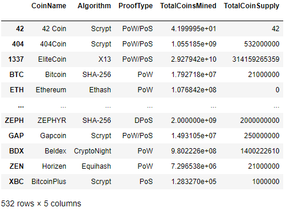
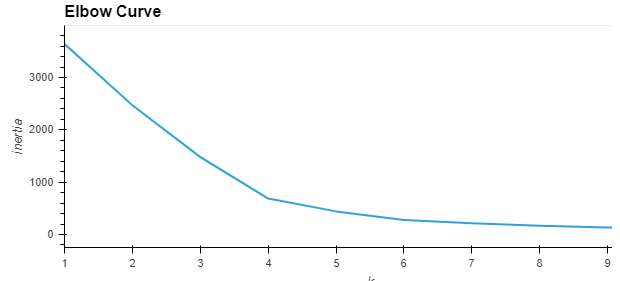
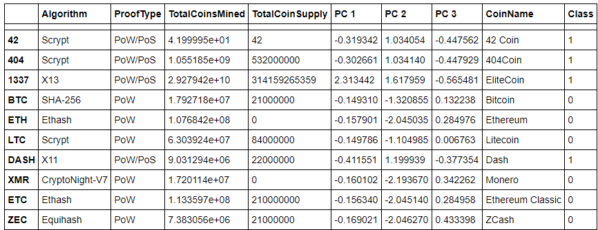

# Cryptocurrencies

During this project, I helped Accountability Accounting analyze and classify crypto data. They wanted the data cleaned, segmented, and grouped, so they could better understand which cryptocurrencies are the best to invest in. In turn, they can provide better support to their clients by understanding which cryptos show the most promise for the future.

The data used in this project was nowhere near perfect, so I had to prep it to work for the machine learning model. I decided to use an unsupervised machine learning model, because there was no known output. To group the cryptocurrencies, I decided on a clustering algorithm. In this deliverable we used data visualizations to share our findings with the board.

## Preprocessing the Data
I completed initial data pre-processing to remove any cryptocurrencies that are not suitable for being added to the investment portfolio, based on the following criteria:

The cryptocurrency is currently trading
- The cryptocurrency has a working algorithm
- The cryptocurrency does not have any null values in the dataset
- The cryptocurrency has a non-zero number of coins already mined

After removing the cryptocurrencies that do not meet the above criteria, and any unnecessary columns, I created the below DataFrame to hold the clean dataset. There are 532 cryptocurrencies that currently fit my clients investment criteria.

## Principal Component Analysis (PCA) and clustering cryptocurrencies Using K-Means
I performed principal component analysis to determine the 3 components that have the greatest impact for grouping the data into clusters. The 3 components can be found in the new DataFrame seen below. To determine the optimal number of clusters for the cryptocurrencies, I created an elbow curve chart to visualize the different values for K, used in the K-means clustering algorithm. The chart below shows that the optimal number of clusters is 4, as the 'elbow' is found at k=4. The 4 clusters are described in the 'Class' column, described as classes 0, 1, 2 and 3.

The complete findings of each of these methods are included in the "crypto_clustering" jupyter notebook file attached above.
